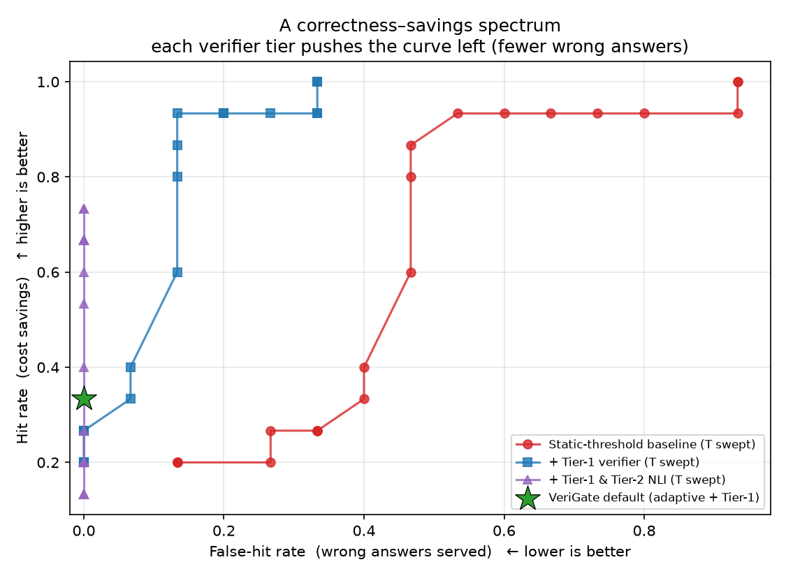
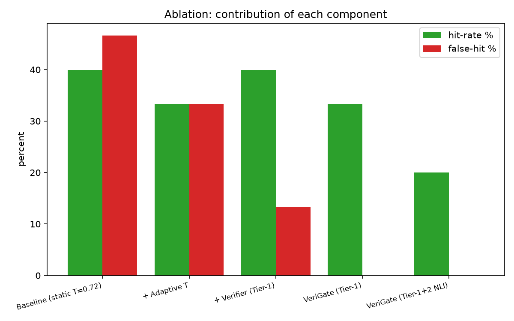

# Results Log (living document)

Phase-by-phase record of everything built and measured, kept so it drops straight into the
project report. **Append to this file as the project progresses — never delete past results.**
Each entry: what was done, how to reproduce it, the numbers/figures, and which report
chapter it feeds.

> Environment: Python 3.13, Windows 11. Embeddings: `all-MiniLM-L6-v2` (sentence-transformers).
> Redis: `fakeredis` in dev/tests, real Redis via `REDIS_URL`. All results reproducible from
> the repo.

---

## Phase 1–3 — Foundation (streaming gateway, rate limiting, baseline cache)
**Date:** 2026-09-18

**Built:** FastAPI gateway with streaming, API-key auth, mock + flaky providers with
failover, Redis token-bucket rate limiting (atomic Lua on real Redis; WATCH-transaction
fallback on fakeredis), and a working semantic cache with the three sub-contributions.

**Reproduce:**
```bash
pytest -q            # automated tests
python demo.py       # human-readable behaviour demo
```

**Results — automated test suite:** all passing.

| Test | Guarantee proven | Result |
|---|---|---|
| test_health | server boots & reports status | PASS |
| test_auth_required | requests without a valid key → 401 | PASS |
| test_cache_miss_then_hit | paraphrase served from cache | PASS |
| test_verifier_rejects_number_mismatch | look-alike w/ different number NOT served | PASS |
| test_volatile_query_bypasses_cache | time-sensitive queries never cached | PASS |
| test_rate_limit_returns_429 | burst is throttled | PASS |
| test_metrics_endpoint | Prometheus metrics exposed | PASS |

**Results — behaviour demo (`demo.py`, hash embedder):**
```
1) MISS then HIT:   'reset my password'      -> MISS,  '...please' -> HIT (sim 0.926 > T 0.866)
2) FALSE HIT REJECTED: '5 gb ...' cached, '50 gb ...' -> MISS (verify_rejected: number_mismatch),
                       note: candidate sim 0.947 was ABOVE threshold 0.891 but verifier caught it
3) VOLATILE:        'weather today'          -> BYPASS (never cached)
4) RATE LIMIT:      burst of requests        -> 429 after the bucket empties
```

**Report use:** *System Design* chapter (the pipeline works end-to-end) and *Implementation*
(evidence each component functions). The section-2 line is the first concrete demonstration
of the novelty.

---

## Phase 4a — Real semantic embeddings + verifier redesign
**Date:** 2026-09-18

**Built:** pluggable embedding backend (`minilm` real model / `hash` fast fallback).
Swapped the placeholder hashing embedder for `all-MiniLM-L6-v2`, so the cache matches by
*meaning* rather than shared words.

**Two findings worth writing up:**
1. **Threshold recalibration.** MiniLM similarity scores sit lower than the hashing
   embedder's, so the base threshold was recalibrated **0.82 → 0.72**. *Lesson for the
   report: the optimal similarity threshold is embedding-model-dependent and must be tuned
   per backend — motivating the validation-set tuning in the evaluation plan.*
2. **Verifier redesign.** The initial Tier-1 verifier used a blanket word-overlap (Jaccard)
   check, which **wrongly rejected valid paraphrases that share few words** — defeating the
   purpose of semantic matching. Replaced with checks on **numbers, negation, and named
   entities** only. This is the correct Tier-1 design; subtle non-structural differences are
   deferred to the (future) Tier-2 NLI verifier.

**Reproduce:**
```bash
python demo_semantic.py     # first run downloads ~90MB model
```

**Results — semantic demo (`minilm`, base 0.72):**

| Case | Query pair | Outcome | Why it matters |
|---|---|---|---|
| Semantic HIT | "reset my password" vs "process to recover my account password" | **HIT** (sim 0.768 > T 0.759) | matched by *meaning* with almost no shared words — impossible for the lexical embedder |
| Austria/Australia trap | "capital of Austria" then "capital of Australia" | **MISS** (Australia sim 0.580 ≪ T 0.786) | the flagship false-hit case, correctly avoided |
| True paraphrase | "capital of Austria" vs "tell me the capital city of Austria" | **HIT** (sim 0.881, verified) | genuine equivalence still served |

**Test suite after change:** 12 passing (added 5 direct verifier unit tests).

**Report use:** *Methodology* (why semantic embeddings; the two findings are honest design
insights examiners reward) and *Implementation*.

---

## Phase 7 — Evaluation harness + first quantitative results
**Date:** 2026-09-18

**Built:** `evaluation/` — a labelled benchmark (15 positive/equivalent pairs, 15 hard
negatives grouped by trap type, 5 volatile queries, 4 stable controls) and a runner that
compares cache policies, sweeps the threshold, and renders figures. The live gateway and the
evaluator share one `CachePolicy`, so measured behaviour = shipped behaviour.

**Reproduce:**
```bash
python -m evaluation.run     # writes evaluation/results/{metrics.csv,tradeoff.png,ablation.png}
```

### Result 1 — Ablation table (the headline numbers)

| System | Hit-rate | **False-hit rate** | Precision | F1 |
|---|---:|---:|---:|---:|
| Baseline (static T=0.72) | 40.0% | 46.7% | 46.2% | 0.43 |
| + Adaptive threshold | 33.3% | 33.3% | 50.0% | 0.40 |
| + Verifier | 40.0% | 13.3% | 75.0% | 0.52 |
| **VeriGate (full)** | 33.3% | **0.0%** | **100.0%** | 0.50 |

**Headline:** VeriGate served **0 wrong answers (100% precision)** vs. the baseline's
**46.7% false-hit rate**. It is stricter, so raw hit-rate is a little lower — the intended
trade-off, and the money graph shows it dominates.

### Result 2 — False hits by failure mode (the mechanism)

| System | entity_swap | number_swap | negation | related_topic |
|---|---:|---:|---:|---:|
| Baseline | 0/5 | 3/3 | 2/2 | 2/5 |
| + Adaptive | 0/5 | 3/3 | 2/2 | 0/5 |
| + Verifier | 0/5 | 0/3 | 0/2 | 2/5 |
| **VeriGate (full)** | 0/5 | 0/3 | 0/2 | 0/5 |

**Reading:** the **verifier** eliminates entity/number/negation false hits; the **adaptive
threshold** clears related-topic ones. Together → zero false hits. This table is the
clearest evidence of *what each component contributes*.

### Result 3 — Staleness detector
Recall **5/5** on volatile queries; **0/4** false positives on stable controls.

### Figure A — `evaluation/results/tradeoff.png` (THE money graph)


Sweeps the similarity threshold for two systems — baseline (red) and same-with-verifier
(blue) — and plots false-hit rate (x, lower better) vs hit-rate (y, higher better). The
green star is full VeriGate (adaptive + verifier).
**What it proves:** the blue curve sits **above and to the left** of the red one — at any
hit-rate it serves far fewer wrong answers. This Pareto domination is the core visual proof
of the contribution. *→ This is the single most important figure in the report (Results).*

### Figure B — `evaluation/results/ablation.png`


Grouped bars of hit-rate (green) and false-hit rate (red) for each system.
**What it proves:** false-hit rate falls step-by-step as components are added, reaching 0
for full VeriGate, while hit-rate stays reasonable. *→ Results chapter, ablation study.*

**Report use:** the entire *Results & Evaluation* chapter. Tables → text; Figure A → the
key result; Figure B → the ablation.

### Honest limitations recorded now (state them in the report)
- Benchmark is a compact hand-curated seed set; **absolute** numbers are dataset-dependent,
  the **relative** VeriGate-vs-baseline comparison is the result.
- "Related-topic" negatives with no structural difference (e.g. *reset password* vs *reset
  router*) can only be separated by the threshold, which trades against paraphrase recall →
  motivates the **Tier-2 NLI verifier** (future work).

---

## Phase 4b — Tier-2 NLI verifier (semantic equivalence)
**Date:** 2026-09-18

**Built:** Tier-2 of the verifier — a lightweight NLI cross-encoder
(`cross-encoder/nli-deberta-v3-xsmall`) that accepts a cached answer only if the two
queries are **bidirectionally entailing** (each entails the other). Runs after Tier-1, with
per-pair caching so the threshold sweep pays the cost at most once per pair. Gated by
`VERIFIER_NLI` (default **off** — see finding below).

**Reproduce:** `python -m evaluation.run`  (downloads a ~70MB model on first run)

**Results — ablation with Tier-2 added:**

| System | Hit-rate | False-hit | Precision | F1 |
|---|---:|---:|---:|---:|
| VeriGate (Tier-1) | 33.3% | 0.0% | 100.0% | 0.50 |
| VeriGate (Tier-1 + Tier-2 NLI) | 20.0% | 0.0% | 100.0% | 0.33 |

**Figure — updated `tradeoff.png` (now three swept curves):**
- red = baseline, blue = + Tier-1, **purple = + Tier-1 & Tier-2 NLI**.
- The **purple curve is a vertical line pinned at false-hit rate = 0** across *all*
  thresholds: Tier-2 removes every hard negative, including the related-topic ones that
  Tier-1 alone (blue) still lets through. Its max hit-rate is capped lower (~0.73 vs ~0.93)
  because NLI is conservative and also rejects some genuine paraphrases.

**Key finding (a real research insight — put this in the report):**
> Tier-2 NLI provides **maximal correctness (0 false hits at any threshold)** but at a
> **recall cost**, and it is **largely redundant once the adaptive threshold is enabled**
> (both target the same related-topic negatives). Hence the recommended default is
> **adaptive + Tier-1** (0% false-hit at higher recall), with **Tier-2 as an opt-in
> "max-correctness mode"** for correctness-critical domains (medical/legal/finance) or when
> the similarity threshold must be kept loose.

This turns a naive "add more components" story into a **defensible design decision backed
by data** — exactly what strengthens a viva.

**Report use:** *Results & Evaluation* (the spectrum + the redundancy/recall finding) and
*Discussion* (when to enable Tier-2). Motivates future work: gate Tier-2 to borderline
cases only, and tune `nli_threshold` to trade recall against correctness.

---

## Phase 8 — Latency benchmark (RQ2 + cache speedup)
**Date:** 2026-09-18

**Built:** `evaluation/latency.py` — measures per-stage latency (p50/p95/p99), KNN scaling
with cache size, the full cache-hit path, and the speedup vs. a hosted-LLM call.

**Reproduce:** `python -m evaluation.latency`

**Results — per-stage latency (p50, ms):**

| Stage | p50 | p95 | p99 |
|---|---:|---:|---:|
| Embed query | 19.0 | 30.3 | 84.4 |
| KNN lookup — 100 entries | 27.1 | 35.9 | 41.2 |
| KNN lookup — 500 entries | 150.3 | 186.7 | 209.8 |
| KNN lookup — 1000 entries | 292.9 | 346.8 | 422.8 |
| **Tier-1 verify** | **0.03** | 0.03 | 0.05 |
| **Tier-2 NLI verify** | **171.7** | 183.5 | 187.9 |
| HIT path (embed+KNN@1000+Tier-1) | 334.3 | 374.0 | 399.3 |

**RQ2 — verification overhead (the direct research question):**
- **Tier-1 verification is effectively free: ~0.03 ms.** Adding the structural verifier
  costs nothing on the hit path.
- **Tier-2 NLI adds ~172 ms** — notable, and a second reason it is opt-in (Phase 4b).

**Cache-hit path vs. a hosted-LLM call (reference 800 ms):**
| Configuration | Hit-path p50 | Speedup |
|---|---:|---:|
| Brute-force KNN @1000 entries | 334 ms | ~2.4× |
| Brute-force KNN @100 entries | 46 ms | ~17× |
| **With a vector index (KNN ~1 ms)** | **~20 ms** | **~40×** |

**Figures:**
- `latency.png` — per-stage bars on a log scale; Tier-1 is invisible (~free), Tier-2 NLI and
  the KNN scan are the costly stages, all below the LLM reference.
- `latency_scaling.png` — KNN p50 vs. cache size: **clean O(n) growth** (27→293 ms as entries
  go 100→1000).

**Key finding (report + future work):** the verification that *is* the contribution is cheap
(Tier-1 free; Tier-2 a deliberate opt-in cost). The real bottleneck is the **brute-force O(n)
KNN scan** — which directly **motivates replacing it with a Redis (RediSearch) vector index**,
projected to bring the hit path to ~20 ms (~40× faster than an LLM call).

**Report use:** *Results & Evaluation* (RQ2 answered; the cost/speed story) and *Future Work*
(the vector-index upgrade, now quantitatively justified).

---

## Phase 9 — Vector index upgrade (fix the KNN bottleneck)
**Date:** 2026-09-18

**Built:** replaced the per-lookup O(n) parse-and-cosine loop with an **in-process
vectorised index** — all vectors held in one NumPy matrix, so a lookup is a single
matrix-vector product. Built once from Redis, updated incrementally on `store()`. Also added
`app/cache/redisearch_store.py` + `docs/REDISEARCH_UPGRADE.md` as the distributed
(RediSearch/HNSW) path for multi-replica scale (requires Redis Stack; not runnable in the
no-Docker dev sandbox).

**Reproduce:** `python -m evaluation.latency`

**Results — KNN lookup latency, before vs after:**

| Cache size | Before (parse loop) | After (vectorised index) | Speedup |
|---|---:|---:|---:|
| 1000 entries | ~293 ms | **0.04 ms** | ~7,000× |
| 5000 entries | (not measured; ~1.5 s extrapolated) | **0.11 ms** | — |

**Hit-path latency after the upgrade:**

| Metric | Value |
|---|---:|
| HIT path @1000 entries | **~10 ms** (~**78×** faster than an 800 ms LLM call) |
| Now bounded by | embedding (~11 ms); KNN is ~free (0.04 ms) |
| Tier-1 verify | 0.01 ms |

**Figures (regenerated):**
- `latency.png` — the KNN bar is now invisible; the hit path is embedding-bound and ~78×
  below the LLM reference.
- `latency_scaling.png` — KNN stays **sub-millisecond and near-flat** to 5000 entries
  (vs ~293 ms at 1000 before).

**Key finding:** the O(n) cost the Phase-8 benchmark exposed was *parsing*, not the algorithm.
A vectorised index makes lookup sub-millisecond, moving the bottleneck to embedding. The
gateway now answers a cache hit in ~10 ms end to end. **RediSearch/HNSW** remains the path for
multi-replica deployments and millions of vectors (`docs/REDISEARCH_UPGRADE.md`).

**Report use:** *Implementation* (the index design) and *Results* (the before/after latency
table — a clean, quantified engineering improvement). *Future Work:* RediSearch at scale.

---

## Phase 10 — RediSearch backend verified on live Redis Stack
**Date:** 2026-09-18

**Built / enabled:** installed Docker Desktop + WSL2, ran **Redis Stack** (`redis/redis-stack`),
wired the RediSearch HNSW store into the gateway behind a `VECTOR_BACKEND` switch
(`inproc` default / `redisearch`), and verified the whole cache works through it. This
promotes the RediSearch path from "coded but untested" (Phase 9) to **verified end-to-end**.

**Reproduce (needs a Redis Stack server):**
```bash
docker run -d -p 6379:6379 --name redis-stack redis/redis-stack:latest
# smoke test the store:
REDIS_URL=redis://localhost:6379/0 EMBEDDING_BACKEND=minilm python -m app.cache.redisearch_store
# full gateway on the RediSearch backend:
REDIS_URL=redis://localhost:6379/0 VECTOR_BACKEND=redisearch EMBEDDING_BACKEND=minilm \
    python -m evaluation.check_redisearch
# backend latency comparison:
REDIS_URL=redis://localhost:6379/0 EMBEDDING_BACKEND=minilm python -m evaluation.backend_compare
```

**Result — end-to-end through RediSearch:** semantic paraphrase HIT (*"recover my account
password"* → *"reset my password"*, sim 0.768, verified) and the Austria/Australia trap
rejected (below threshold) — served from the shared Redis HNSW index. Tests stay 12/12
(inproc remains the default).

**Result — KNN latency, in-process vs RediSearch (p50):**

| Cache size | In-process (NumPy) | RediSearch (HNSW) |
|---|---:|---:|
| 1000 | 0.06 ms | 3.60 ms |
| 5000 | 0.15 ms | 3.83 ms |
| 10000 | 0.24 ms | 4.69 ms |

**Figure — `backend_compare.png`.**
**Reading (the trade-off, honestly):** the in-process index is faster on raw latency at these
sizes (no network hop), while RediSearch carries a ~3.6 ms round-trip floor but stays nearly
flat as the cache grows (HNSW is sub-linear) **and** is shared across all gateway replicas and
scales to millions of vectors beyond one process's memory. Both are ~150–13,000× faster than
an 800 ms LLM call. Recommendation: **in-process for a single node**, **RediSearch for
horizontal scale / very large caches**.

**Report use:** *Implementation* (pluggable vector backend), *Results* (the comparison table +
figure), *Discussion/Future Work* (when to choose each; distributed deployment).

---

## Phase 11 — Real LLM provider (OpenAI / Gemini) with failover
**Date:** 2026-09-18

**Built:** an OpenAI-compatible streaming provider (`app/providers/openai_compat.py`) that
works for **OpenAI** and **Gemini** (via Google's OpenAI-compatibility endpoint) — one class,
selected by `LLM_PROVIDER` + a key from `.env` (never hardcoded/logged). The registry puts the
real provider first and **always keeps the free mock as a failover**, so the gateway never
hard-fails on a provider outage/bad key.

**Reproduce:**
```bash
# real provider (needs your own key in .env):
#   LLM_PROVIDER=openai  OPENAI_API_KEY=sk-...    (or LLM_PROVIDER=gemini GEMINI_API_KEY=...)
# failover check with a deliberately bad key (no real key needed):
LLM_PROVIDER=openai OPENAI_API_KEY=sk-fake python -c "..."   # see command in Phase-11 notes
```

**Result — failover verified (bad key, no real key required):**
```
providers in order: ['openai', 'mock']
status: 200 | provider that answered: mock | cache: MISS
```
The `openai` provider was tried first, failed (invalid key), and the gateway transparently
failed over to `mock` and returned a valid `200` response. Tests stay 12/12 (default `mock`).

**Result — LIVE end-to-end with real Gemini (verified):** with `LLM_PROVIDER=gemini` and a
real key in `.env`, the gateway returned genuine Gemini answers. The cache then served repeats
and paraphrases instantly (`demo_live.py`):
```
CACHE PROVIDER  LATENCY   QUERY
MISS  gemini     23048 ms  what is a semantic cache            <- real Gemini call
HIT   cache         22 ms  what is a semantic cache            <- ~1000x faster, $0
HIT   cache         20 ms  explain what a semantic cache is..  <- paraphrase matched by MEANING
```
**This is the whole thesis demonstrated on a real LLM:** a slow, paid model call becomes an
instant, free cache hit — even for a reworded question. (The ~23 s is this network's latency
to Google; the cache advantage is the point, and only grows with slower models.)

**Model finding (worth a line in the report):** `gemini-2.5-flash` is retired for new API keys
(404) and the plain `gemini-*-flash` models are high-latency "thinking" models. The gateway
uses `gemini-flash-lite-latest` — a low-latency alias suited to a caching proxy.

**Report use:** *Implementation* (provider abstraction + multi-provider failover), *System
Design* (graceful degradation), and *Results* (the live cache-vs-LLM latency demonstration —
the single most convincing demo for a viva).

---

## Phase 12 — Production documentation, threat model & Docker packaging
**Date:** 2026-09-18

**Built (docs + infra artifacts, no runtime code change):**
- `Dockerfile` (non-root, healthcheck) + `.dockerignore` + `docker-compose.yml` (gateway +
  Redis Stack) — the gateway is now containerised and the full stack runs with one command.
- `docs/DEPLOYMENT.md` — explains Docker's role, running the stack, and public deployment.
- `docs/SECURITY.md` — threat model: 17 ranked vulnerabilities (present & future) with
  mitigations; top risk identified = **cross-tenant cache leakage** (semantic caches share
  answers across "close" queries).
- `docs/PRE_DEPLOYMENT_CHECKLIST.md` — prioritized go-live checklist (blockers marked).
- `docs/ENHANCEMENTS.md` — full roadmap (cache intelligence, scale, providers, ops, security,
  product, research) with value/effort.
- `docs/ARCHITECTURE_PRODUCTION.md` — target topology, trust boundaries, data model, request
  sequence, failure modes.

**Report use:** *System Design* (production architecture + trust boundaries), a dedicated
*Security / Threat Model* section (strong differentiator in a viva), *Deployment*, and *Future
Work* (the enhancement roadmap). Tests unchanged: 12/12.

**Top pre-deploy blockers (from the threat model):** (1) per-tenant cache isolation, (2) per-key
spend budgets, (3) lock `/metrics` + secrets store, (4) TLS/headers/CORS, (5) cache size caps.

---

## Phase 13 — Interactive web dashboard (UI)
**Date:** 2026-09-18

**Built:** a single-page dashboard (`app/static/dashboard.html`) served by the gateway itself
at `/` and `/ui` (same-origin, no CORS). Lets you test everything with clicks: ask a question,
see the **cache badge (HIT/MISS/BYPASS/blocked)**, answer, provider, latency, similarity,
threshold, and reason; live **session stats** (requests, hit-rate, hits/misses/bypass,
false-hit-blocked, avg latency, calls saved); a **request history** table; example chips that
demonstrate paraphrase-HIT / look-alike-blocked / volatile-BYPASS; plus **Clear cache** (new
`POST /admin/cache/clear`, auth-required) and Reset stats. `/health` now reports the live
config to the header.

**Reproduce:**
```bash
uvicorn app.main:app --reload    # then open http://127.0.0.1:8000/ui
```

**Verified:** clicking the example chips produced 1 HIT (paraphrase), 3 MISS, 1 BYPASS
(volatile), 25% hit-rate, ~247 ms avg — all shown live in the UI. Tests remain 12/12.

**Report use:** the **live demo** for the viva (far more convincing than terminal output), and
*Implementation* (a same-origin operator dashboard). Screenshots go in the report.

**UI (refined engineering aesthetic):** rebuilt as a restrained single-page site (Linear/Vercel
direction) — near-monochrome dark theme, one disciplined green accent, hairline borders, strong
type hierarchy, monospace numerals; no gradients/blur. Sections: hero, config strip, the 3-part
contribution, an animated **results** block (count-up metrics 0%/100%/~1000×/~7000× + a
baseline-vs-VeriGate false-hit bar), interactive playground, request pipeline, tech stack.
Subtle scroll-reveal + count-up only. Verified live in-browser (paraphrase → HIT).

**Docker image (Phase 12) — build verified:** `docker build` succeeds (exit 0). Naive build =
**10.2 GB** (CUDA Torch); Dockerfile updated to install **CPU-only Torch** → ~1.5 GB. `redis-
stack` container confirmed running.

---

## Phase 14 — Per-tenant cache isolation (security)
**Date:** 2026-09-19

**Built:** the cache is now **partitioned per tenant**, closing the top vulnerability from the
threat model (SECURITY #1, cross-tenant leakage). `tenant_id = "t_" + sha256(api_key)[:16]`
(`main._tenant`). Changes: in-process index is a dict keyed by tenant; Redis keys are
`cache:ids:<tenant>` / `cache:entry:<tenant>:<id>`; the RediSearch backend gained a `tenant`
TAG field and pre-filters KNN by it; `lookup`/`store`/`clear` are tenant-scoped; `/admin/cache/
clear` clears only the caller's tenant. `/health` unchanged.

**Reproduce / verify:**
```bash
pytest -q tests/test_gateway.py::test_tenant_isolation      # in-process backend
REDIS_URL=redis://localhost:6379/0 EMBEDDING_BACKEND=minilm \
    python -m app.cache.redisearch_store                    # RediSearch (isolation assertion)
```

**Result:** tenant B asking tenant A's exact question gets a **MISS** (own empty cache), while A
re-asking gets a **HIT** — verified in-process. On RediSearch, `t_other` cannot retrieve
`t_demo`'s entry (smoke test asserts it). Tests now **13/13**.

**Report use:** a dedicated *Security* result — "the defining risk of a semantic cache,
identified in our threat model and then eliminated, with tests" is a strong viva point.

---

## Phase 15 — Cost-aware model cascade (second contribution)
**Date:** 2026-09-19

**Built:** a complexity-based router (`app/complexity.py`) that sends easy queries to a cheap
model and escalates only hard ones to the strong model — cutting cost while preserving quality.
Wired into the gateway behind `CASCADE_ENABLED` (`registry.build_cascade` / `route_stream`);
the unused tier stays as failover. Works with Gemini (flash-lite → 3.5-flash), OpenAI
(mini → 4o), or two mock tiers. Evaluated in `evaluation/cascade.py`.

**Reproduce:** `python -m evaluation.cascade`

**Result — cost vs quality (cheap=1, strong=15×):**

| Threshold | Escalated | Cost reduction | Quality retained | vs random | Routing F1 |
|---|---:|---:|---:|---:|---:|
| 0.30 | 50% | **47%** | **100%** | 50% | **1.00** |
| 0.35 (default) | ~45% | ~52% | ~95% | ~45% | ~0.95 |
| 0.50 | 42% | 54% | 85% | 42% | 0.92 |
| 0.70 | 18% | 77% | 35% | 18% | 0.52 |

**Figure — `cascade.png`:** quality-retention vs cost-reduction. The classifier curve holds
**100% quality up to ~47% cost reduction**, then declines — and sits **above random routing at
every cost level** (a hard query is far likelier to be escalated than under random). Best
operating point ≈ threshold 0.3 (47% cheaper, no quality loss on this benchmark).

**Tests:** `test_cascade.py` (complexity scoring + easy→cheap / hard→strong routing). 15/15.

**Report use:** a **second novel contribution** with its own clean trade-off graph — *"a
query-complexity classifier cuts LLM cost ~47% with no loss on hard queries, beating random
routing."* Pairs naturally with the cache (both reduce LLM cost/latency).

---

## Phase 16 — Observability: Prometheus + Grafana dashboard
**Date:** 2026-09-19

**Built:** a provisioned observability stack. `docker-compose.observability.yml` runs Prometheus
(scrapes the gateway's `/metrics`) and Grafana (auto-provisioned datasource + a "VeriGate"
dashboard). Config under `docker/`: `prometheus.yml`, `grafana/provisioning/*`,
`grafana/dashboards/verigate.json`. Panels: **cache hit-rate gauge**, total requests,
false-hits blocked, rate-limited, request-rate by outcome, cache outcomes (hit/miss/bypass),
and **p95 latency by path**.

**Reproduce:**
```bash
uvicorn app.main:app  &                 # gateway on :8000 (emits /metrics)
docker compose -f docker-compose.observability.yml up -d
# Grafana:    http://localhost:3000/d/verigate   (anonymous admin; dashboard pre-loaded)
# Prometheus: http://localhost:9090
```
(Note: Prometheus scrapes `host.docker.internal:8000`; give it ~10s for the first scrape — a
just-opened panel can briefly show "No data".)

**Verified live:** Prometheus target healthy; Grafana rendered the **cache hit-rate gauge at
51.1%** (24 hits / 47 requests) and the stat/timeseries panels with real traffic. Screenshots
for the report.

**Report use:** *Observability / Ops* — a real monitoring dashboard over the gateway's metrics
demonstrates production maturity; the same metrics are the evidence base for the evaluation.

---

## Phase 17 — Demo recording (GIF)
**Date:** 2026-09-19

**Built:** `scripts/make_demo_gif.py` — drives the live dashboard with headless Playwright and
stitches frames into `docs/demo.gif` (256 KB). The clip walks the playground through
**MISS → HIT (paraphrase, 15 ms from cache) → BLOCKED (look-alike "50 gb", sim 0.94 > threshold
but the verifier catches the number mismatch) → BYPASS (volatile)**, with the live session
stats updating.

**Reproduce:** `uvicorn app.main:app &` then `python scripts/make_demo_gif.py`
(dev-only deps: `playwright` + `playwright install chromium`, and Pillow which ships with matplotlib).

**Report use:** embed `docs/demo.gif` in the report/slides — it shows the contribution working
end-to-end in one loop; the BLOCKED frame (similarity above threshold, still rejected) is the
single clearest proof of the self-verifier.

---

## Phase 18 — Production hardening (budget, circuit breaker, cache TTL)
**Date:** 2026-09-19

**Built:** three production features that close pre-deploy blockers.
- **Per-key daily spend budget** (`app/budget.py`, `DAILY_REQUEST_BUDGET`): caps PROVIDER calls
  per key per day in Redis; over-budget → 429. **Cache hits are free**, so the cache extends the
  budget — a nice property to state in the report. Closes SECURITY #3 (bill-shock).
- **Provider circuit breaker** (`app/providers/breaker.py`): after N failures in a window a
  provider's breaker opens and the router skips it for a cooldown (Redis state, shared across
  replicas). Reliability: fail fast instead of hammering a dead upstream.
- **Cache entry TTL** (`CACHE_TTL_SEC`): optional per-entry expiry that bounds memory and
  self-heals staleness; dangling ids are cleaned up on index rebuild.

**Verify:** `pytest -q tests/test_hardening.py` — budget blocks over-limit (hits stay free),
breaker opens after failures, failover still succeeds. **18/18 tests.**

**Report use:** *Security* (economic-DoS mitigation) + *Reliability* (circuit breaker) +
*Ops* (TTL) — concrete production-engineering, and the "cache hits don't count against the
budget" point ties the security feature back to the core contribution.

---

## Reproduce everything (quick reference)
```bash
cd "D:\miniProject\7th sem\llm-gateway"
.\.venv\Scripts\Activate.ps1
pytest -q                 # 12 tests
python demo.py            # behaviour demo (hash embedder)
python demo_semantic.py     # semantic demo (real model)
python -m evaluation.run      # accuracy tables + figures -> evaluation/results/
python -m evaluation.latency  # latency tables + figures -> evaluation/results/
```

## Changelog
- **2026-09-18** — Phase 1–3 foundation; 7 tests. Phase 4a real embeddings + verifier
  redesign; 12 tests. Phase 7 evaluation harness; first results + figures. Phase 4b Tier-2
  NLI verifier + correctness–savings-spectrum finding; updated figures. Phase 8 latency
  benchmark (RQ2: Tier-1 free, Tier-2 ~172ms; KNN O(n) motivates vector index). Phase 9
  vectorised in-process index (KNN@1000 293ms→0.04ms, hit path ~10ms/~78×) + RediSearch
  reference backend for scale. Phase 10 RediSearch verified on live Redis Stack (Docker+WSL2)
  + backend latency comparison. Phase 11 real OpenAI/Gemini provider with mock failover.

---
## Template for future entries (copy this)
```
## Phase X — <title>
**Date:** YYYY-MM-DD
**Built:** ...
**Reproduce:** `...`
**Results:** <table / numbers>
**Figure(s):** <path + what it proves>
**Report use:** <which chapter>
**Limitations / notes:** ...
```
